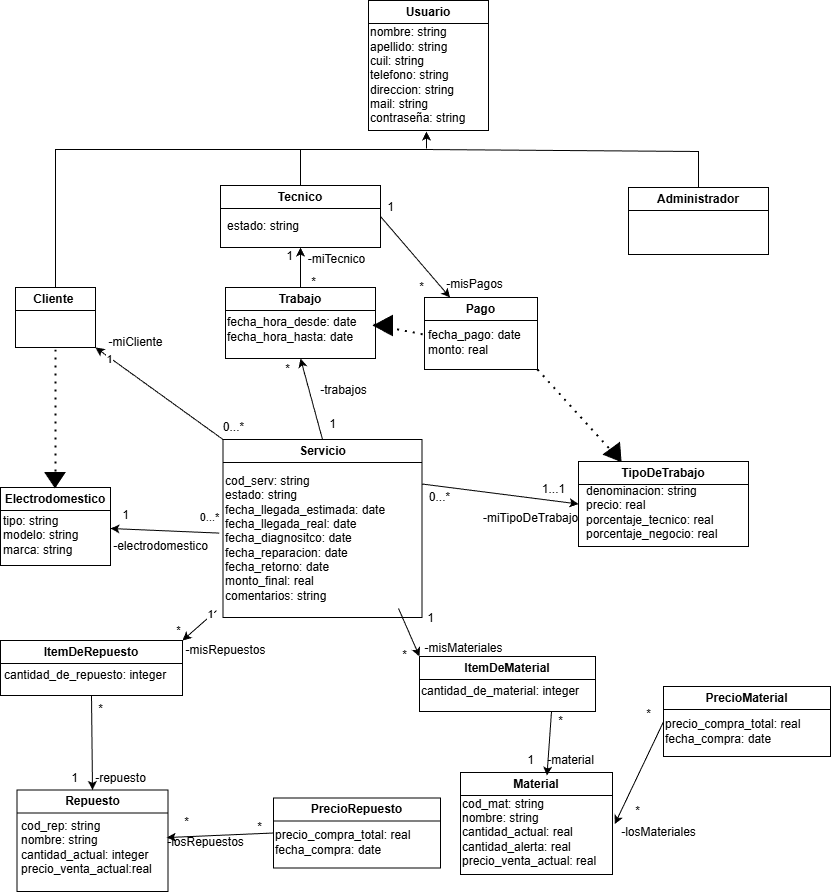

# Propuesta TP DSW

## Grupo
### Integrantes
* 47921 - Garabelli, Joaquin
* 49848 - Bellini, Esteban
* 49876 - Hintersech, Lara

### Repositorios
* [frontend app](https://github.com/estebannbn/frontend-electroservi)
* [backend app](https://github.com/estebannbn/backend-electroservi)

## Tema
### Descripción
Nuestro sistema será una web para un negocio de servicio técnico de electrodomésticos. Hay 3 tipos de usuarios: Clientes, Técnicos, y Administradores; cada uno con distintas funciones.

### Modelo

## Alcance Funcional 

|Req|Detalle|
|:-|:-|
|CRUD simple|1. CRUD Usuario 2. CRUD TipoDeTrabajo 3. CRUD Material 4. CRUD Repuesto 5. CRUD Electrodoméstico|
|CRUD dependiente|1. CRUD Cliente {depende de} CRUD Usuario 2. CRUD Tecnico {depende de} CRUD Usuario 3. CRUD Administrador {depende de} CRUD Usuario 4. CRUD Trabajo {depende de} CRUD Servicio y CRUD Tecnico 5. CRUD Servicio {depende de} CRUD TipoDeTrabajo y CRUD Cliente|
|Listado + detalle| 1. Listado de servicios filtrado por rango de fecha y estado. Muestra cantidad de servicios reparados, cantidad con solo diagnostico, cantidad de heladeras, cantidad de microondas, cantidad de televisores, fondos totales recaudados, suma de gastos, suma de gastos en pedidos => detalle resumen general de todos los servicios en dicho rango de fechas  2. Listado de tipos de trabajo. Muestra cantidad de servicios de este tipo realizados, ganancias totales generadas, ganancias totales para los técnicos, ganancias totales para el negocio => detalle muestra estadísticas|
|CUU/Epic|1. Registrar cliente 2. Solicitar servicio 3. Modificar datos de usuario 4. Registrar técnico 5. Registrar pago a tecnico 6. Deshabilitar o habilitar un técnico 7. Modificar tipo de trabajo 8. Modificar o registrar material 9. Modificar o registrar repuesto 10. Realizar Pedido de materiales 11. Realizar Pedido de repuestos 12. Realizar relevamiento de servicio 13. Pedir repuestos para servicio 14. Pedir materiales para servicio 15. Finalizar relevamiento de servicio 16. Modificar servicio 17. Mostrar estadísticas de periodo 18. Aceptar reparacion 19. Mostrar resultados de reparación|

### Comentarios
1. Podriamos cambiar el listado 2 de la tabla anterior.
